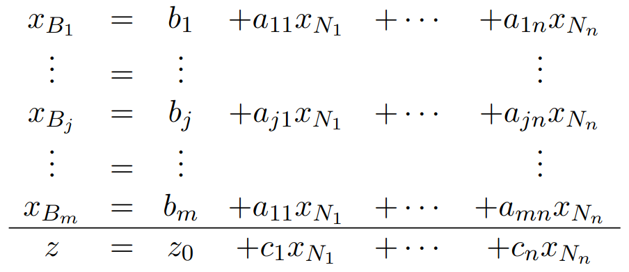

# Les entrées pour la méthode du simplex

Si vous vous êtes baladé dans le code, il y a souvent des références à "*SimplexForm*", qui est un object représentant une entré à un problème du simplex.  

Cette représentation d'entrées a été reprise et adapté du cours en ligne ["*Integer and linear programming*" sur coursera](https://www.coursera.org/learn/linear-programming-and-approximation-algorithms), présenté par [S. Sankaranarayanan](https://home.cs.colorado.edu/~srirams/) et [S. D. Ruben](https://www.colorado.edu/lab/automation/people/dr-shalom-d-ruben), de [l'université Boulder, Colorado](https://www.colorado.edu/). [Vidéo de présentation](https://youtu.be/1ZPaTI5e128?si=qfZOySvS2rlx3IQa) du cours.  

Les [fichiers des tests unitaires](/tests/unitTests/) sont sous la forme standardisé, et font de bon exemples.

Un fichier d'entrées standardisé se représente donc sous cette forme:  
```
m n
B1 B2 ... Bm
N1 N2 ... Nn
b1 b2 ... bm
a11 a12 ... a1n
...
am1 am2 ... amn
z0 c1 ... cn
```

Qui, sous sa forme mathématique, ressemble à ceci:  

> Il y a une typo sur `a11xN1` à l'avant dernière ligne. Cela devrai être `am1xN1`.

> [!NOTE]
> Ce n'est pas la représentation habituel de la forme standard d'un problème d'optimisation linéaire.  
> Mais on peut la déduire à partir de ces entrés, sans transformations, si on ignore les lignes des indices `B` et `N`.  

> [!CAUTION] Attention
> Lors de la lecture du fichier, tout caractères autre que `0123456789.-`, ainsi que l'espace et le retour à la ligne, soulèvent immédiatement une erreur.  
> De plus, toutes mauvaises représentations d'un chiffre (un nombre précédé de deux signes moins, ou un virgule constituée de deux points subséquent, des 0 au début inutiles), soulèvent eux aussi une erreur immédiate.
>
> Pour finir, les nombres à virgule, ou *flottant*, ont leurs parties entière et décimale séparées par **un point**, et non une virgule.

1. `m` est un **entier**, supérieur ou égal à 1, qui donne le nombre de **constraintes**. Il donne aussi, par définition, le nombre de variables basiques.
2. `n` est un **entier**, supérieur ou égal à 1, qui donne le nombre de **variables**. Il donne aussi, par définition, le nombre de coefficients par constrainte, et le nombre de coefficient de la fonction objective `z`.
3. `Bi` est un **entier**, supérieur ou égal à 1, qui correspond à la variable basique `i`. Il **doit** y avoir `m` `Bi`. Si il y en a plus, les supplémentaires seront ignorés. Si il y en a moins, un erreur est levée.
4. `Ni` est un **entier**, supérieur ou égal à 1, qui correspond à la variable hors base `i`. Il **doit** y avoir `n` `Ni`. Si il y en a plus, les supplémentaires seront ignorés. Si il y en a moins, un erreur est levée.
5. `bi` est un **flottant** quelconque, qui correspond au second membre de la constrainte `i`, dans la forme standard. Il **doit** y avoir `m` `bi`. Si il y en a plus, les supplémentaires seront ignorés. Si il y en a moins, un erreur est levée.
6. `aij` est un **flottant** quelconque, qui correspond au coefficient `j` de la constrainte `i`. Il **doit** y avoir `m` lignes, sinon une erreur est levée. Il **doit** y avoir `n` `aij` par ligne. Si il y en a plus, les supplémentaires seront ignorés. Si il y en a moins, un erreur est levée.
7. La dernière ligne **est lue après la dernière ligne de coefficients**, et est constituée de `n+1` valeurs:
   1. `z` est un **flottant** quelconque, qui correspond une constante ajoutée à la fonction objective. Il **doit** être présent, même si c'est un 0.
   2. `ci` est un **flottant** quelconque, qui correspond au coefficient `i` de la fonction objective. Il **doit** y avoir `n` `ci`. Si il y en a plus, les supplémentaires seront ignorés. Si il y en a moins, un erreur est levée.
